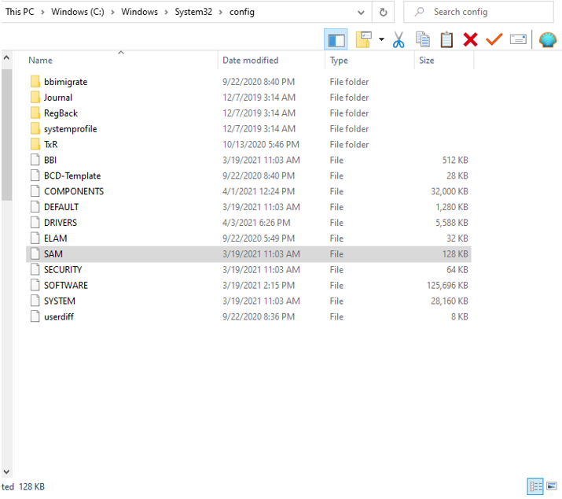

# Introduction

Even with the most advanced methods for encrypting password files, human users remain notorious for using overly simple passwords. This can be a troubling fact especially when one considers that if the technology for password protection has advanced, so too has the technology for password cracking. In order to demonstrate this concept, a majority of this lab is dedicated to using two well-known programs for password cracking to decipher two file types which commonly store passwords. As you will see in the lab, this is done to varying degrees of success. Finally, this lab will analyze the properties of the password file on my own machine including its filename, location, and the integrity of its contents.

## Setting Up the Workspace and Acquiring Lab Files

Per the lab instructions’ recommendation, this lab will be taking place in the SimSpace Kali-Hunt virtual machine (to be precise, however, it also takes place over several terminals). It is at this point I already began to encounter obstacles in this lab. Several of the terminals had frozen while I was trying to access the three files that are necessary for the lab. Finally, upon launching terminal kali-hunt-20, I was able to log in without issue and begin my work on the lab. This workspace is where a vast majority of the lab will be held. After successfully logging in, I locate the “shared files” directory and navigate through the Lab4 and Lab4A folders to locate the needed files.

- <i>Figure 1</i>: The shared files directory as it appears in the kali-hunt-20. It includes shadow, a text file, along with sam and system, which identified as program files.

  

The first file in the window is a SAM file which is a database file for Windows that stores user’s passwords (Kali Linux Tutorials). This, along with the system file, will be used for the second password cracking program. The middle one, shadow, is a text file that contains the usernames of eight accounts along with their passwords after being hashed by a hashing algorithm.

- <i>Figure 2</i>: The account names and hashed passwords as they appear in the shadow text file. This particular form of hashing is classified as MD5 crypt with salts.

  

With my workspace in place, I can now begin working with the first password cracking program.

## Using John the Ripper and Johnny to Crack the Shadow File

This section of the lab will deal with the password cracking program John the Ripper and its GUI-based counterpart, Johnny. According to its official website, John the Ripper is an Open-Source password security auditing and password recovery tool that is terminal-based and is able to interpret multiple forms of hashing (Openwall). In this case, I will be using it to decipher the hashed passwords for the account names in the shadow text file.

As mentioned, John the Ripper is a terminal-based program. So, then. I must first begin the process by navigating the terminal to the appropriate directory. By typing “cd /mnt/share/Lab4/Lab4A,” I change the directory to the folder that contains the shadow file. From there, I type “john shadow” (“john” being the command to run John the Ripper and “shadow” being the target file) into the prompt to run the first of several password cracking attempts. This is a standard form of cracking in that there are no options, modifiers, or parameters. This means that John the Ripper will proceed in its “natural” way. That is, it will progress through three different cracking methods that gradually become more complex. All that is needed for this process is a wordlist, which is a text file that contains one word per line, and a target file.

The cracking process for John the Ripper is as follows: It begins with “single crack” mode, switches to “wordlist” mode, and finishes with “incremental” mode. “Single crack” mode is an essential starting point that will use login names, “GECOS” (password records)/ “Full Name” fields, and the users’ home directory names as candidate passwords along with a large set of mangling rules (Openwall). These mangling rules allow the simultaneous testing of variations of a given password candidate (think John, J0HN, Nhoj, John! and so on). This is the fastest form of cracking because the information used for an account’s password(s) only comes from that account. Next up is the wordlist method. In simple terms, this method can be likened to a dictionary attack. The program takes a wordlist, hashes each entry, and compares the hashes to the ones in the target file. If a match is found, the cracked password is output. Lastly, the process concludes with the incremental method. However, it is not exactly accurate to say it concludes since the process will not terminate and instead perpetually move on to more complex passwords. Again, in more common hacking terms, this is similar to a brute force attack. The only difference is that the incremental mode still works under certain parameters.

Going back to the first attempt, executing the “john shadow” command commences the cracking process.  First off, the program finds the wordlist file Wordlist and uses it to measure up any potential hashes. In doing so, the passwords for “ccwhite” and “fred” are cracked, as shown below. This then concludes the single crack method, and the program moves on to the wordlist method. In doing so, the entries to the file “password.lst” are taken, hashed, and measured up against the hashes in the shadow file. As a result, the password for “mary” is cracked. As the figure below shows, this only makes sense.

- <i>Figure 3</i>: In order to better illustrate the wordlist method, I have accessed and opened the password.lst file as a text file. Using CTRL + F, you can see that the password to “mary,” which is “secret” can be found in this file thus making it an excellent example of a dictionary attack.

  

The next figure below shows John the Ripper cracking the passwords in real time:

- <i>Figure 4</i>: The cracked passwords as they appear throughout the cracking process. They are highlighted in yellow and notice that they appear in plain text in a password-name order. “ccwhite” and “fred” are cracked with the single crack method, and “mary” is cracked with the wordlist method.

  

From there, the program moves on to the incremental method. At this point, the program will now try random combinations of characters until it gets it right. Surprisingly, it manages to find one fairly quickly as we see the password for “user1” get spat out after a few failed attempts:

- <i>Figure 5</i>: The password for “user1” appearing after the incremental method has begun. Notice the first four attempts have failed and the final (highlighted) one at the bottom is correct.

  

It is at this point progress comes to a halt. After “user1,” no additional passwords are cracked. This claim has been thoroughly tested with multiple attempts at cracking with different parameters. Once of these is a cracking pass with the “--fork=6” option, which allows six testing processes to occur at a time (Openwall). I had two terminals open with these settings, and let them run through the incremental test over a period of approximately twenty hours. Even after all that time and processing, no additional passwords were found. The website BetterBuys provides an estimate stating that any passwords with eight or less characters can be cracked within five hours but those with nine or more can take over five days. This is beyond the timeframe of this lab, so it is therefore my conclusion that the remaining passwords are too long or too complex to be figured out within a reasonable amount of time.

To go even further, I took the liberty of cracking the shadow file with Johnny. Johnny has the same functionality as John the Ripper but is run through a GUI. Using the “open password file” button, I load the shadow file onto the pane and hit “start attack” to begin the cracking process. Based on one of its information panels, the cracking process for Johnny is overall the same as John the Ripper except in this case, the user is only given a GUI and everything else is handled on the backend. Like John the Ripper, progress halts after “user1.” However, after some point in the scanning process, “ftrpilot” was also cracked. The figure below shows the partially completed password logs:

- <i>Figure 6</i>: The Johnny GUI panel. The first five passwords have been cracked while the final three remain unknown. As of writing this paper, this process has been going on for over fifteen hours with no sign of the final passwords turning up.

  

Although this debunks the idea that “ftrpilot” has too complex of a password, there is still enough evidence to reasonably conclude that “user2,” “user3”, and “user4” have passwords that are either complex, or over eight characters. With this established, there is nothing more to be done at this stage and we are now ready to move on to the next program.

## Running Ophcrack and Trying (and Failing) to Crack the SAM and System Files

This next section of the lab will be dealing with Ophcrack which is another popular password cracking program. Ophcrack’s official website describes the program as being a free Windows password cracker based on rainbow tables (Ophcrack). Rainbow tables, in turn, are files that are potentially enormous and contain passwords together with their hash values and the encryption algorithm that was used (IONOS). To briefly explain, rainbow tables work by attempting to discover plaintext passwords through a cached authentication database (CyberHoot). It is no wonder, then, that these tables tend to be made up of leaked, common, and overly simple passwords. However, analysis of modern security technology seems to imply that rainbow tables have largely become obsolete due to password salting and hashing. The main target of Ophcrack is a SAM, or Security Accounts Manager, file. To elaborate on what was previously mentioned, A SAM file is a database file that is used in Windows XP, Windows Vista, and Windows 7 to store users’ passwords (Kali Linux Tutorials). The SAM and system files for the lab, then, hold account passwords that need to be cracked.

Similar to John the Ripper and Johnny, Ophcrack can be run through either a terminal with Ophcrack-cli, or through a GUI with its standard edition. There is nothing to be gained from using the terminal so for this portion of the lab, I will only be using the standard GUI version of Ophcrack. To begin, of course, I must first load the SAM file onto the program. However, it does not seem to be able to read the SAM file directly so instead, I load up the system file. This is where the two become interconnected. After loading the system file, four distinct LM hashes appear and are ready to be cracked. Now comes the matter of finding the appropriate reference table. The ones (or, rather, one) needed for this lab already comes preloaded. From there, all that is left to do is hit “crack” and wait. After running this cracking process quite a few times, I conclude that it takes on average five minutes. However, to be thorough, I have allowed the process to run for lengths exceeding seven hours with an overall total of fourteen hours of runtime. In doing so, absolutely no passwords are discovered. The figure below shows the GUI panel of Ophcrack post-scan. Note the time elapsed.

- <i>Figure 7</i>: The Ophcrack GUI panel. The column label states that the hashes are in the LM Hash format, but this is later disproved. As of writing this paper, this process has been running for eight hours and thirty minutes. No passwords have ever been retrieved. Also, notice that the progress bar and table usage suggest that the SAM and system files contain passwords for Windows XP.

  

Given the results of this cracking attempt, I conclude that the passwords in the SAM and system files do not match those in the XP free small rainbow table and that they are more complex than what Ophcrack is currently equipped to handle.

## Experimenting with CrackStation to Produce Similar Results

Using intricate open-source technology to crack password hashes is all well and good, but the truth is, the technology to crack these passwords can be found in common, easy-to-access websites. A good example of this is the website CrackStation. The “about” section of the website describes CrackStation as being a security awareness project that is meant to raise awareness about insecure password storage and guide implementors of user authentication systems (CrackStation). In other words, the website demonstrates how easy it is to crack simple, non-salted passwords which should, as a result, make the user more conscious of choosing stronger passwords. The website can do this because it claims it extracted every word from the Wikipedia databases along with every password list the developers could find. However, the hashes written in the shadow file are in the MD5 crypt format which is a problem because CrackStation does not support this. Even worse, the MD5 crypt format cannot be converted to standard MD5 which the website does support. This leads to two conclusions: First, no new passwords from the shadow file will be discovered in this step. Second, the only way CrackStation can be used to somewhat reproduce the results (that I can think of) is through the following process: Take the cracked passwords, which were cracked from the MD5 crypt format, use another website, in this case PELock’s Hash Calculator, to hash the cracked passwords into MD5, and then feed the passwords, now hashed with MD5, into CrackStation so that they can be deciphered again. The figure below shows the final result of this process:

- <i>Figure 8</i>: CrackStation with MD5 input and cracked output. Only through the method I described above could I get the website to work properly. All entries are green which means that these passwords are an exact match to their respective hashings.

  

As if that was not enough, I also ran into extensive trouble with the SAM and system files. Ophcrack’s GUI panel implies that the imported hashes are in the LM, or Lan Management, format. However, the hashes provided do not match up with anything CrackStation, or any other hashing calculator, can recognize. This leads me to conclude that the passwords in the SAM and system files are exceptionally strong and well-hashed. The figure below shows one of the attempts to crack the hashes:

- <i>Figure 9</i>: And here on the other hand we see the indecipherable hashes from the SAM and system files. These hashes do not fit the LM hash format and I could not modify them so that they could. The red color and results column indicates that this is an unrecognizable hashing format (even if I add the braces at the end of each hash).

  

## Finding My Own Computer's Password File and Analyzing Its Properties

For the final section of the lab, we will be stepping out of the Kali-Hunt virtual machine and into my own computer. This purpose of this part of the lab is to show the properties of a computer’s password file in a more practical way. To find my own password file, I had to navigate to C:/Windows/System32/config. In this file, my computer’s SAM file can be found.

- <i>Figure 10</i>: My Windows (C:)/Windows/System32/config directory as it appears on my computer. My SAM file has been selected. Very little (or none) of these files can be moved or modified in any way (or at least not without administrator permission and quite a few warning boxes).

  

Like the sample file provided, my computer’s password file is called SAM and I imagine it has a similar structure. Although this file can be copied, it cannot be pasted anywhere because an error box will pop up claiming that the file is currently in use. Given that the SAM file is located in System32, which is the backbone of the entire computer, this makes sense. Moreover, after doing some searching on the internet, I found that passwords in the Windows 10 SAM file can be cracked. This seems to have been intentional for the sake of password recovery. The website Passfab lists several methods of cracking the password including running commands through the CMD, resetting the password, cracking with administrator privilege, using the program 4WinKey, and, of course, using Ophcrack. This leads me to believe that my SAM file can be cracked in a way that is very similar to the way I used Ophcrack to crack the SAM and system files from earlier (that is, if it actually works). With all this being done, the lab concludes.

# Conclusion and Discussion

Overall, I must say this was an extremely difficult lab due to things such as vague directions and not getting the results both I and the lab instructions expected. I took great care and large amounts of time in order to ensure that the errors I got in this lab could not be avoided. Nevertheless, it did offer some valuable insight regarding what makes a strong password. I think the main takeaway here is that password length is one of the key factors in making a strong password. Merely having a password that surpasses twelve characters can make it uncrackable for centuries to come. This, factored with special characters, casing, and substitutions, can make for exceptionally strong passwords. Looking back at it, I suppose that the current information systems I work with use acceptable password policies. For instance, the passphrases for UTSA IDs will take an especially long time to crack and even the ones at my workplace, Best Buy, cannot be easily cracked. Finally, and perhaps needless to say, passwords are an integral part of identity access management systems since they are one of the main forms of authentication. Therefore, it is essential that the information behind what makes a good password should be more widespread so that people can better avoid making themselves easy targets for cybercrime.

# Appendix

Provided below are links to additional tools I used or referenced throughout this lab:

For hashing the cracked passwords into MD5:
<a href="https://www.pelock.com/products/hash-calculator" target="_blank">Hash Calculator</a>

For gauging an effective password length:
<a href="https://random-ize.com/how-long-to-hack-pass/" target="_blank">Password Hacking Time Estimator</a>

# References

<a href="https://kalilinuxtutorials.com/chntpw/#:~:text=The Security Accounts Manager (SAM,USB with kali Linux installed" target="_blank">
Chntpw - Windows Password, Account Forensics - Kalilinux</a>

<a href="https://crackstation.net/about-us.htm" target="_blank">About CrackStation</a>

<a href="https://www.betterbuys.com/estimating-password-cracking-times/" target="_blank">Estimating Password Cracking Times</a>

<a href="https://www.passfab.com/windows-10/crack-windows-10-password.html" target="_blank">How to Crack Windows 10 Password</a>

<a href="https://www.openwall.com/john/doc/MODES.shtml" target="_blank">John the Ripper - Cracking Modes</a>

<a href="https://www.openwall.com/john/" target="_blank">John the Ripper Password Cracker</a>

<a href="https://cyberhoot.com/cybrary/rainbow-tables/" target="_blank">Rainbow Tables</a>

<a href="https://ophcrack.sourceforge.io/" target="_blank">Ophcrack</a>

<a href="https://www.ionos.com/digitalguide/server/security/rainbow-tables/" target="_blank">What are Rainbow Tables?</a>

